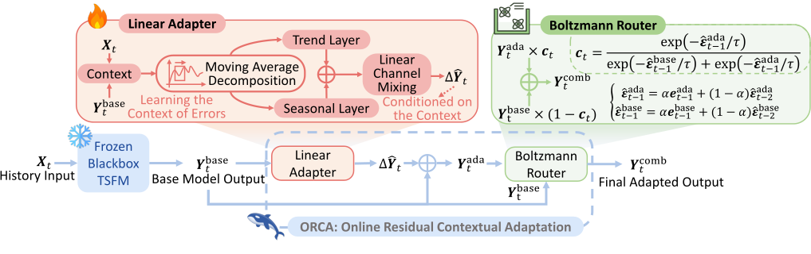

#  Learning the Context of Errors: Black-Box Online Adaptation of Time Series Foundation Models

NeurIPS 2026 · [Paper](https://arxiv.org/abs/2606.14222)



- Black-box adaptation enables time series foundation models (TSFMs) to adapt to evolving streams without access to their parameters or gradients, including closed-source API settings.
- ORCA (Online Residual Contextual Adaptation) combines a context-conditioned linear adapter, a decaying replay buffer, Bayesian regularization, and a Boltzmann router.
- We study a fundamental learning hypothesis for online TSFM adaptation: **learning the context of errors**, conditioned on the base model's inputs and predictions.

## Installation

From the repository root, create one environment for all five backbones:

```bash
python3 -m venv .venv
source .venv/bin/activate
python -m pip install -r requirements.txt
```

## Data and checkpoints

Download the eight datasets (ETTh1, ETTh2, ETTm1, ETTm2, Exchange, Weather, Electricity, and Traffic):

```bash
python -m data.download_CSV --dataset all
```

CSVs are saved to `data/data_cache/`. Download the chosen backbone checkpoint, for example:

```bash
hf download amazon/chronos-2 --local-dir checkpoints/chronos-2
```

## Run ORCA

Use `run.py` for ORCA and baseline evaluations. The paper configuration uses context length 520 and forecasting horizons 30, 96, and 336:

```bash
python run.py \
  --dataset all --model chronos-2 \
  --tsfm_model_prefix checkpoints \
  --refiner ORCA --refiner_input xy --update_rule bayesian \
  --context_length 520 --pred_len 30 96 336 \
  --online_buffer_windows 3000 --train_batch_size 256 \
  --random_seed 42 --device cuda:0 --cache
```

Use `--model all` to evaluate all five backbones, or `--dataset ETTh1 --pred_len 96` for a single setting. Data are split chronologically into 70%/10%/20%; metrics are reported on the test partition.

`--cache` saves base-model forecasts under `data/model_infer_cache/` on the first run and reuses them on subsequent runs, including different refiners. Add `--resume_eval` to skip completed evaluations. Results are written to `results/MAE_summary/` and `results/MSE_summary/`, including averages across the requested horizons; detailed records are under `results/details/`.

## Baselines

Run the paper's adaptation baselines and the two statistical baselines with the same evaluation settings:

```bash
python run.py \
  --dataset all --model chronos-2 \
  --tsfm_model_prefix checkpoints \
  --refiner AdaY DSOF TAFAS SOLID ELF Ridge ETS \
  --context_length 520 --pred_len 30 96 336 \
  --random_seed 42 --device cuda:0 --cache
```

`AdaY` selects the Ada-Y variant of δ-Adapter. DSOF, TAFAS, and SOLID are adapted for black-box use. `Ridge` and `ETS` are the statistical baselines from the appendix. To run one baseline, pass only its name to `--refiner`. See `python run.py --help` for all options.

## License

Original ORCA code is released under [Apache-2.0](LICENSE).

## Citation

If you find our paper useful, please cite:

```bibtex
@article{dai2026learning,
  title={Learning the Context of Errors: Black-Box Online Adaptation of Time Series Foundation Models},
  author={Dai, Xilin and Liu, Yiding and Xia, Hongjie and Hu, Yifan and Dong, Zewei and Yang, Jiang-Ming and Xu, Qiang},
  journal={arXiv preprint arXiv:2606.14222},
  year={2026}
}
```
